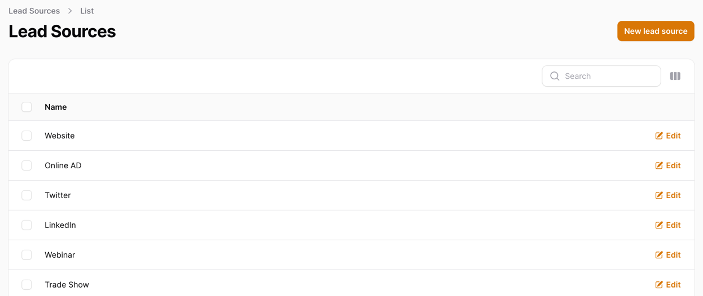
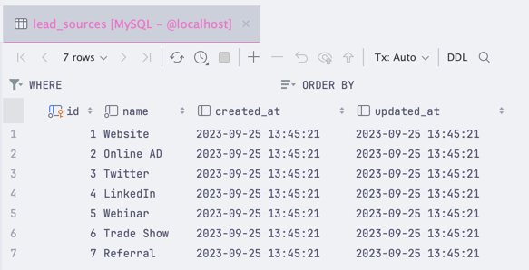
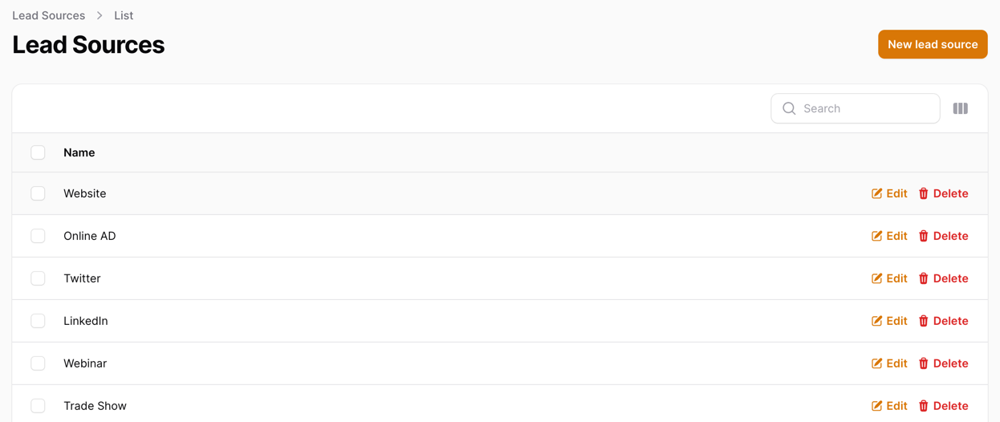
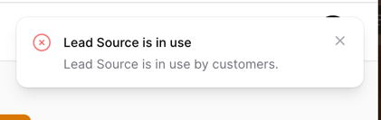
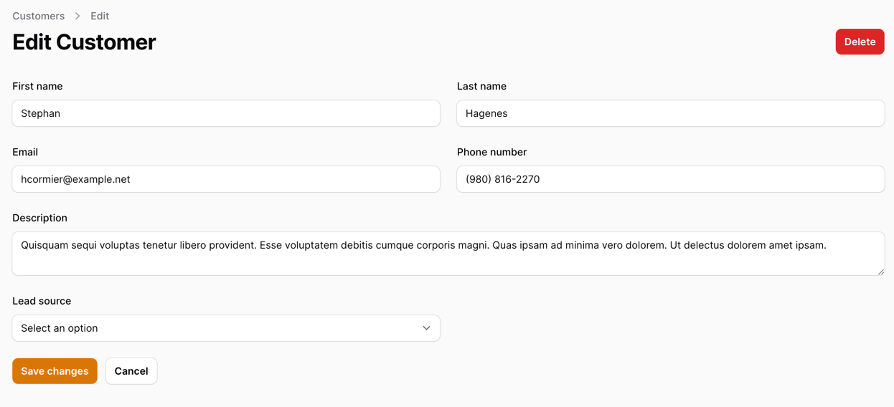
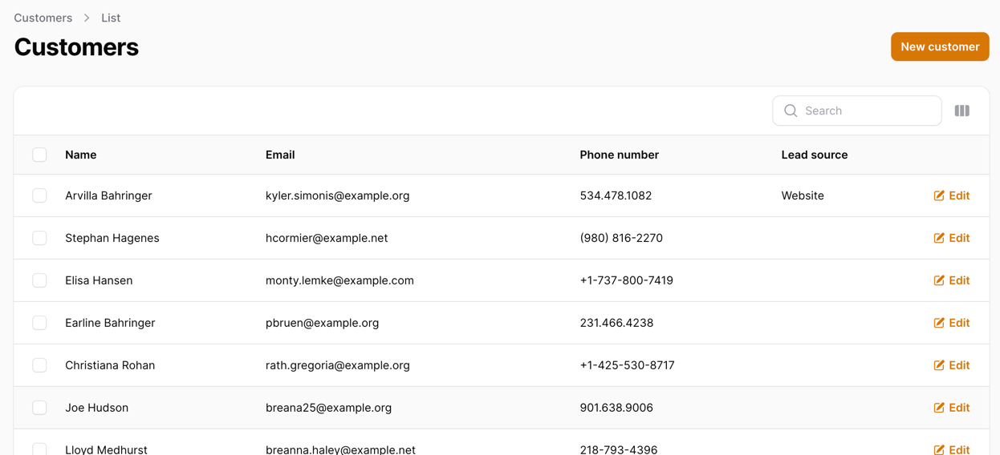
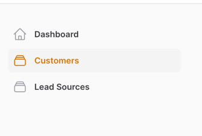
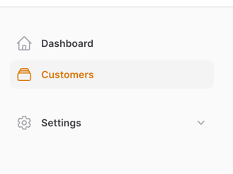
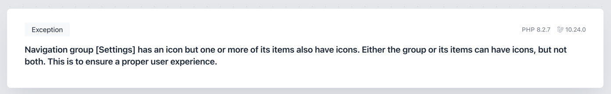

Next up, we need to know where our Customer came from. So for that, we will create a Lead Source Resource in Filament:



The Lead Source Resource will have the following fields:

- `id`
- `name`

And that's it. We want to keep it simple for now.

---

## Creating Lead Source Database

We will start by creating a new database table:

**Migration**
```php  
Schema::create('lead_sources', function (Blueprint $table) {
    $table->id();
    $table->string('name');
    $table->timestamps();
});
```

Then, we will create a new Model for the Lead Source:

**Model**
```php
use Illuminate\Database\Eloquent\Model;
use Illuminate\Database\Eloquent\Relations\HasMany;

class LeadSource extends Model
{
    protected $fillable = [
        'name',
    ];

    public function customers(): HasMany
    {
        return $this->hasMany(Customer::class);
    }
}
```

As you can see, we have already added a relationship to our Customer Model. This will be useful later on.

Then, we can create a seed for our Lead Source:

**database/seeders/DatabaseSeeder.php**
```php
public function run(): void
{
    // ...
    
    $leadSources = [
        'Website',
        'Online AD',
        'Twitter',
        'LinkedIn',
        'Webinar',
        'Trade Show',
        'Referral',
    ];

    foreach ($leadSources as $leadSource) {
        LeadSource::create(['name' => $leadSource]);
    }
}
```

This will seed some basic Lead Sources into our database. Of course, you can add more if you want.

Next, we have the last step - connecting our Lead Source to our Customer via new migration:

**Migration**
```php
use App\Models\LeadSource;

// ...

Schema::table('customers', function (Blueprint $table) {
    $table->foreignIdFor(LeadSource::class)->nullable()->constrained();
});
```

And our last step is modifying our Customer Model:

**app/Models/Customer.php**
```php

use Illuminate\Database\Eloquent\Factories\HasFactory;
use Illuminate\Database\Eloquent\Model;
use Illuminate\Database\Eloquent\Relations\BelongsTo;
use Illuminate\Database\Eloquent\SoftDeletes;

class Customer extends Model
{
    use SoftDeletes;
    use HasFactory;

    protected $fillable = [
        'first_name',
        'last_name',
        'email',
        'phone_number',
        'description',
        'lead_source_id'// [tl! ++]
    ];

    public function leadSource(): BelongsTo// [tl! add:start]
    {
        return $this->belongsTo(LeadSource::class);
    }// [tl! add:end]
    
    // ...
}
```

That's it. You should now have a new table `lead_sources` created with some data inside of it if you run:

```bash
php artisan migrate:fresh --seed
```



---

## Creating Lead Source Resource

To create this Resource, we will use the same command as before:

```bash
php artisan make:filament-resource LeadSource --generate
```

This will once again create the necessary files for us, so all we have to do is load the page and see what we got:


It loads nicely and already has the data from our database. Even the create form is working. But there's one thing we need to change:

- There's no delete! - We need to have a delete button for our Lead Source, and it has to check if there are no Customers connected to it.

So let's do that by modifying our `LeadSourceResource`:

**app/Filament/Resources/LeadSourceResource.php**
```php
// ...

public static function table(Table $table): Table
{
    return $table
        ->columns([
            Tables\Columns\TextColumn::make('name')
                ->searchable(),
            Tables\Columns\TextColumn::make('created_at')
                ->dateTime()
                ->sortable()
                ->toggleable(isToggledHiddenByDefault: true),
            Tables\Columns\TextColumn::make('updated_at')
                ->dateTime()
                ->sortable()
                ->toggleable(isToggledHiddenByDefault: true),
        ])
        ->filters([
            //
        ])
        ->actions([
            Tables\Actions\EditAction::make(),
            Tables\Actions\DeleteAction::make()// [tl! add:start]
                ->action(function ($data, $record) {
                    if ($record->customers()->count() > 0) {
                        Notification::make()
                            ->danger()
                            ->title('Lead Source is in use')
                            ->body('Lead Source is in use by customers.')
                            ->send();

                        return;
                    }

                    Notification::make()
                        ->success()
                        ->title('Lead Source deleted')
                        ->body('Lead Source has been deleted.')
                        ->send();

                    $record->delete();
                })// [tl! add:end]
        ])
        ->bulkActions([
            Tables\Actions\BulkActionGroup::make([
                Tables\Actions\DeleteBulkAction::make(),
            ]),
        ]);
}

// ...
```

Let's go over the changes we made:

- We added a `DeleteAction` to our table
- When the `DeleteAction` is clicked, we check if there are any Customers connected to it
- If there are, we show a notification and don't delete the Lead Source
- If there aren't, we show a notification and delete the Lead Source

That's it! This is how it looks in our browser:



And if we try to delete a Lead Source that has Customers connected to it (for this example, we did this directly in the database):



It works! We can't delete a Lead Source with Customers connected to it.

---

## Modifying Customer Resource and Database Table - Adding Lead Source

Now that we have our Lead Sources and can manage them, we should add a select field to our Customer Resource so we can select a Lead Source for our Customer:

**app/Filament/Resources/CustomerResource.php**
```php
// ...

public static function form(Form $form): Form
{
    return $form
        ->schema([
            // ...
            Forms\Components\Textarea::make('description')
                ->maxLength(65535)
                ->columnSpanFull(),
            Forms\Components\Select::make('lead_source_id')
                ->relationship('leadSource', 'name'),
        ]);
}

// ...
```

This should add a select field to our Customer Resource:



As a last step, we must add this field to the table. Otherwise, we won't be able to see it:

**app/Filament/Resources/CustomerResource.php**
```php
// ...

public static function table(Table $table): Table
{
    return $table
        ->columns([
            // ...
            Tables\Columns\TextColumn::make('phone_number')
                ->searchable(),
            Tables\Columns\TextColumn::make('leadSource.name'),// [tl! ++]
            // ...
        ])
        ->filters([
            //
        ])
        ->actions([
            Tables\Actions\EditAction::make(),
        ])
        ->bulkActions([
            Tables\Actions\BulkActionGroup::make([
                Tables\Actions\DeleteBulkAction::make(),
            ]),
        ]);
}
    
// ...
```

Now, loading the Customer table should show us the Lead Source column:



That's it! It is this simple to add a new field to our Resource.

---

## Cleaning Up the Navigation - Adding Settings Dropdown

Since introducing our Lead Sources, we should think about how we want to organize our navigation. What we have now is this:



And it looks alright, but imagine if we have 10 or 20 different Resources. It would be a mess. So let's clean it up a bit by adding a dropdown for our Settings:

**app/Providers/Filament/AdminPanelProvider.php**
```php

use Filament\Navigation\NavigationGroup;
// ....

class AdminPanelProvider extends PanelProvider
{
    public function panel(Panel $panel): Panel
    {
        return $panel
            // ...
            ->navigationGroups([// [tl! add:start]
                NavigationGroup::make()
                    ->label('Settings')
                    ->icon('heroicon-o-cog-6-tooth')
                    ->collapsed(),
            ])// [tl! add:end]
            ->authMiddleware([
                Authenticate::class,
            ]);
    }
}
```

This registers that such a group can be used in our navigation, but we haven't added anything. So let's do that:

**app/Filament/Resources/LeadSourceResource.php**
```php
class LeadSourceResource extends Resource
{
    protected static ?string $model = LeadSource::class;

    protected static ?string $navigationGroup = 'Settings';// [tl! ++]
    protected static ?string $navigationIcon = 'heroicon-o-rectangle-stack';// [tl! --]
    
    // ...
}
```

Once this is done, we should see a new dropdown in our navigation:



This becomes much cleaner and will give us a place to put all our settings.

### Bonus: The Icon Needs to be Removed

As a bonus tip, you might have noticed that we have removed the icon from our `LeadSourceResource`. Filament does not support an icon on the settings dropdown and our resource. Here's what would happen if we did not delete the icon:



